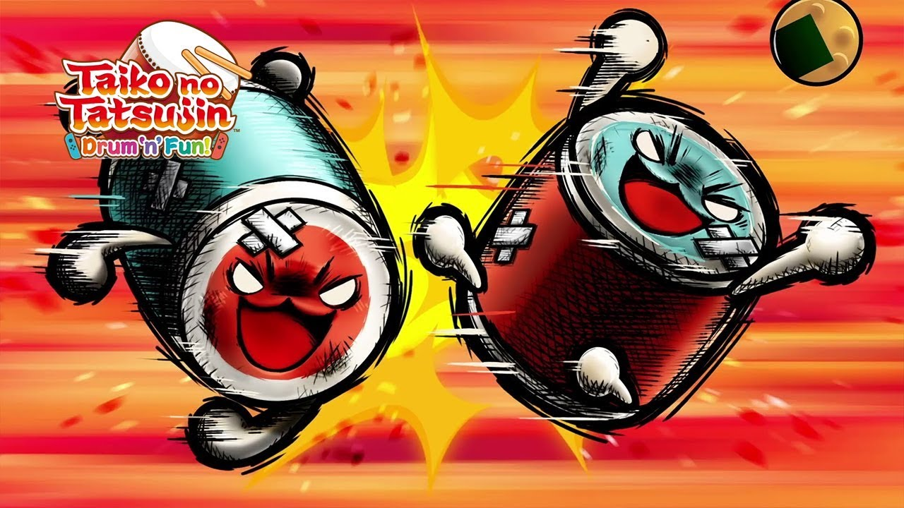

<h1 style="text-align: center;">O disastre da churrascaria</h1>
<h3><i>Por Igor Michelini e Gustavo Rezende</i></h3> 

<h1>Resultado Final</h1>

<h1>Contexto</h1>
Era um dia muito especial, Don havia convidado seu familiares para um churrasco no céu, e diante destes convidados, havia seu irmão, Katsu.
E como em todo bom churrasco de família, começou a discussão sobre futebol:

<i>Foi por isso que o Cássio caiu no Cruzeiro<i> - Disse Don  
<i>ÉOQUE</I> - Gritou Katsu  
<i>Vai fazer o que?</i> - Provou Don, com um olhar de superioridade 

E assim começou uma briga extremamente estupida

Porém, Don não contava com o fato que seu irmão Katsu, fazia academia, e completamente amassou o Don na porrada, e acabou derrubando Don de sua casa
