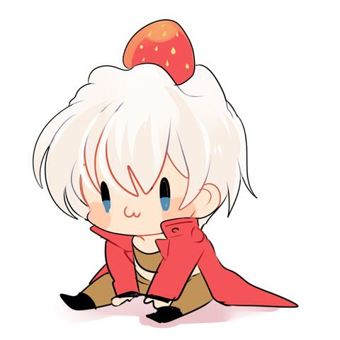
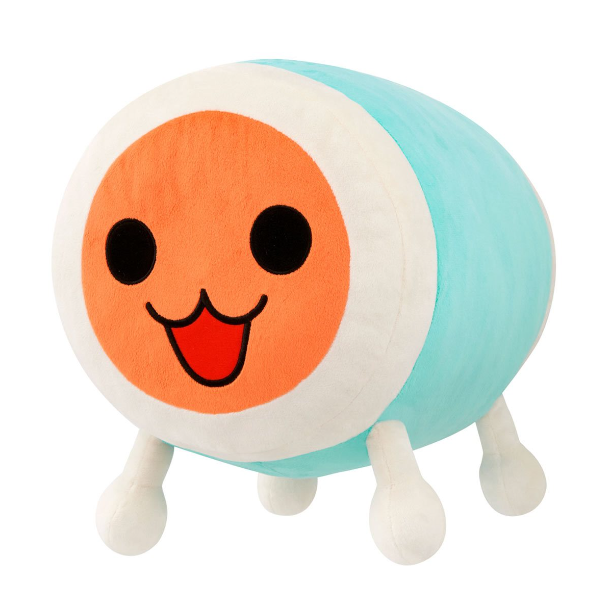

<h1 style="text-align: center;">O Desastre Da Churrascaria</h1>
<h3><i>Por Igor Michelini e Gustavo Rezende</i></h3> 

<h1>Resultado Final</h1>

<h1>Contexto</h1>
Era um dia muito especial, Don havia convidado seu familiares para um churrasco em sua casa, e diante destes convidados, havia seu irmão, Katsu.
E como em todo bom churrasco de família, começou a discussão sobre futebol:

Foi por isso que o Cássio caiu no Cruzeiro - Disse Don  
ÉOQUE?</i> - Gritou Katsu  
Vai fazer o que? - Provou Don, com um olhar de superioridade 

E assim começou uma briga extremamente estupida

Porém, Don não contava com o fato que seu irmão Katsu, fazia academia, e acabou vencendo o Don na luta, que terminou com Katsu derrubando Don de sua casa, caindo em cima de Dante, que estava com um morango em sua cabeça

Não só o morango acabou estourando, mas também Don era o encarregado de fazer o churrasco, logo Dante ficou sujo de carvão, o que o deixou bem triste

<h1>Como fizemos</h1>
Essas foram as imagens que usamos de base para nossos desenhos

Nós utilizamos a ferramenta Pixilart, mais especificamente, as funções:
<ul>
  <li>Lápis</li> 
  <li>Borracha</li>
  <li>Escova</li>
  <li>Linha</li>
  <li>Balde</li>
  <li>Seletor de cores</li>
  <li>Mover</li>
  <li>Selecionar</li>
  <li>Iluminar/escurecer</li>
  <li>Camadas</li>
  <li>Animação</li>
</ul>

Cada uma dessas funções permitiu com que o processo de desenhar fosse mais fácil, com as funções de Linha, Balde e Seletor de cores economizando tempo.
